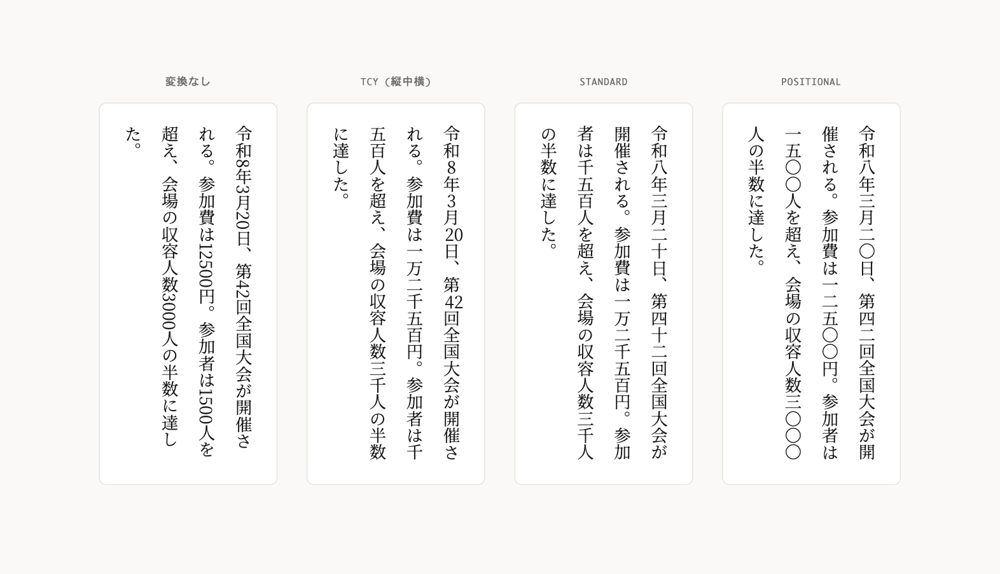

# kandachi

[日本語](README.md) ・ [Demo](https://tai5863.github.io/kandachi/)

Vertical Japanese numeral formatting — Arabic numerals to Kanji numerals, with TCY (tate-chu-yoko) and HTML support.



## Install

```bash
npm install kandachi
```

## Usage

```js
import { format, toKanji, Kandachi } from 'kandachi';

// Convert numbers in text to Kanji numerals
format('12500円');                          // → '一万二千五百円'
format('2026年3月20日', { mode: 'positional' }); // → '二〇二六年三月二〇日'

// Convert a number directly
toKanji(12500);              // → '一万二千五百'
toKanji(12500, 'formal');    // → '壱萬弐仟伍佰'

// Class API for reusing options
const k = new Kandachi({ mode: 'positional' });
k.format('2026年');  // → '二〇二六年'
k.toKanji(42);       // → '四二'
```

## Conversion Modes

| Mode | Example | Description |
|------|---------|-------------|
| `standard` | `12500` → `一万二千五百` | Positional Kanji with units (default) |
| `positional` | `2026` → `二〇二六` | Digit-by-digit — for years, phone numbers |
| `formal` | `12500` → `壱萬弐仟伍佰` | Daiji (formal) — for contracts, receipts |
| `simple` | `1234` → `一二三四` | Simple digit replacement |

## TCY (Tate-Chu-Yoko)

Wraps numbers with 2 or fewer digits in `<span class="tcy">` for horizontal-in-vertical typesetting with CSS `text-combine-upright: all`.

```js
format('12月25日', { tcy: true });
// → '<span class="tcy">12</span>月<span class="tcy">25</span>日'
```

```css
.tcy { text-combine-upright: all; }
```

Options:

```js
format('12月25日', {
  tcy: {
    enabled: true,
    maxDigits: 2,     // Max digits for TCY (default: 2)
    className: 'tcy', // CSS class name (default: 'tcy')
    tag: 'span',      // HTML tag (default: 'span')
  }
});
```

## HTML Processing

Converts numbers in text nodes only, leaving HTML tags untouched.

```js
import { formatHTML, applyToElement } from 'kandachi';

// String-based (no DOM required, SSR-friendly)
formatHTML('<p>2026年</p>', { mode: 'positional' });
// → '<p>二〇二六年</p>'

// DOM-based (browser)
applyToElement(document.querySelector('.vertical'), { mode: 'standard' });
```

## Web Component

```html
<script type="module">
  import 'kandachi/webcomponent';
</script>

<kandachi-ja>12500円</kandachi-ja>
<!-- → 一万二千五百円 -->

<kandachi-ja mode="positional">2026年3月20日</kandachi-ja>
<!-- → 二〇二六年三月二〇日 -->

<kandachi-ja mode="formal">12500円</kandachi-ja>
<!-- → 壱萬弐仟伍佰円 -->

<kandachi-ja tcy>12月25日</kandachi-ja>
<!-- → <span class="tcy">12</span>月<span class="tcy">25</span>日 -->
```

| Attribute | Description |
|-----------|-------------|
| `mode` | `standard` \| `positional` \| `formal` \| `simple` |
| `tcy` | Enable tate-chu-yoko |
| `tcy-max` | Max digits for TCY (default: `2`) |
| `tcy-class` | CSS class for TCY (default: `tcy`) |

## CLI

```bash
npx kandachi "12500円"
# → 一万二千五百円

echo "2026年3月20日" | npx kandachi -m positional
# → 二〇二六年三月二〇日

npx kandachi -m formal "12500円"
# → 壱萬弐仟伍佰円

npx kandachi -t "12月25日"
# → <span class="tcy">12</span>月<span class="tcy">25</span>日
```

## API

### `format(text, options?)`

Converts numbers in text to Kanji numerals.

### `toKanji(num, mode?)`

Converts a number to a Kanji numeral string.

### `formatHTML(html, options?)`

Converts numbers in text nodes while preserving HTML tags. No DOM required.

### `applyToElement(element, options?)`

Converts text nodes within a DOM element in-place. Browser only.

### `wrapTcy(text, options)`

Wraps a string in a TCY HTML tag.

### `new Kandachi(options?)`

Class API for reusing options. Provides `format()` and `toKanji()` methods.

### Options

```ts
interface KandachiOptions {
  mode: 'standard' | 'positional' | 'formal' | 'simple';
  tcy: boolean | Partial<TcyOptions>;
  handleComma: boolean;   // Handle comma-separated numbers (default: true)
  handleDecimal: boolean; // Handle decimal points (default: true)
}
```

## Supported Range

- Integers: `0` to `10^23` (垓 / gai)
- Decimals: supported (`3.14` → `三・一四`)
- Comma-separated: supported (`1,000,000` → `百万`)

## Bundle Size

| Entry | Size (minified + brotli) |
|-------|--------------------------|
| `kandachi` | ~1.2 KB |
| `kandachi/webcomponent` | ~1.3 KB |

## BudouX Integration

Combine with [BudouX](https://github.com/google/budoux) (Google's Japanese line break optimizer) for production-ready vertical Japanese web typography.

```js
import { format } from 'kandachi';
import { loadDefaultJapaneseParser } from 'budoux';

const parser = loadDefaultJapaneseParser();
const text = format('2026年3月、参加者1500人の大会が開催された。');
const html = parser.translateHTMLString(text);
```

## License

[MIT](LICENSE)
